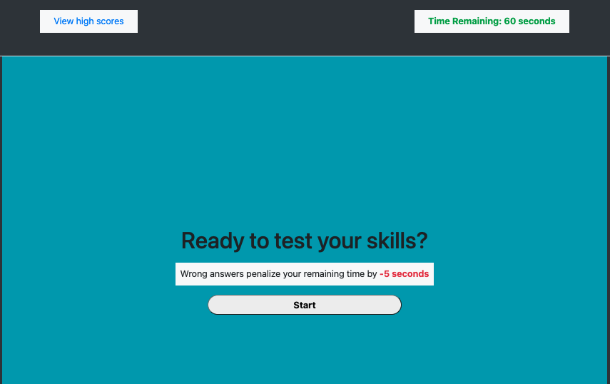

# ONLINE DEV SELF ASSESSMENT

## Quiz Instructions
The quiz begins when the user presses the "start" button. The timer is set to 60 seconds and wrong answers penalizes 5 seconds from the remaining time.

## Dev Notes
### HTML
*   The page structure is built using bootsrap styling.
*   Non-displaying elements serve as placeholders for the questions and possible answers.

### JS
*   The program begins when event listners on the start button are triggered.
*   funcitons and data related to the app are stored as methods and properties of main parent object
*   startQuiz() function is declared which calls these methods in order to work properly

## Link
https://mehranmatin.github.io/dev-self-assessment/

## App Preview

## Made By
Mehran M.

### ©️2022 Mehran M.
